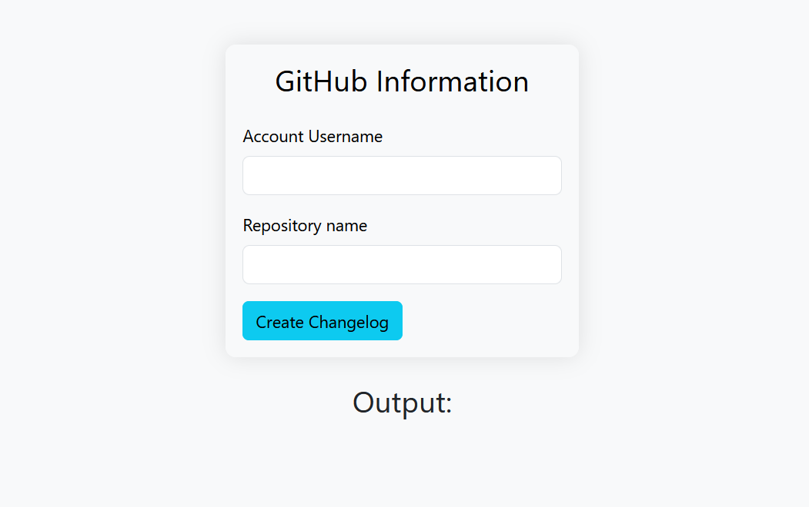
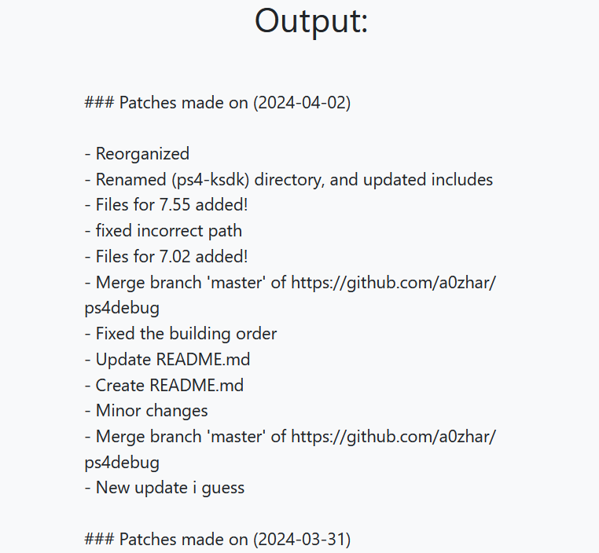

# Github Changelog Generator
This is a super easy-to-use, user-friendly, nice looking, web-based github (markdown style) changelog generator. All that it requires is **The Github Account Username** and **The Repository Name**... Once entered, all that is left to do is to press the button, then tada!!!

The Generated content looks like this:
```md
### Patches made on <YYYY-MM-DD>
- <Commit Title>
  - <Additional Data>
  - <Additional Data>
  - <Additional Data>
  - <Additional Data>
- <Commit Title>
- <Commit Title>
- <Commit Title>
```

It uses latest version of Bootstrap for the UI part, Javascript for the web-Request to get commits...

----
### Screenshots

**Initial Form**


**Generated Changelog**


<br>
----

### Credits
- Me (A0ZHAR)
